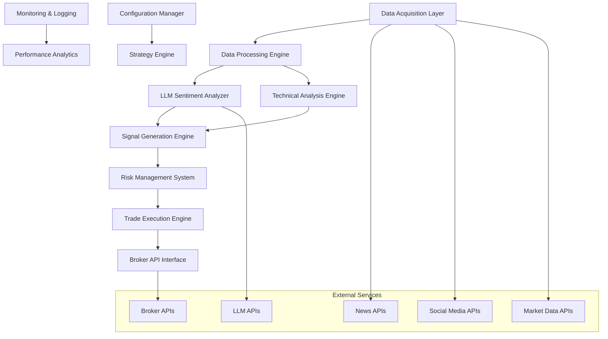

# AI Forex Trading Bot Design Document

## Overview

The AI Forex Trading Bot is a sophisticated automated trading system that combines Large Language Model (LLM) sentiment analysis with traditional technical indicators to make informed forex trading decisions. The system operates as a real-time trading engine that processes market data, news, and social media to generate trading signals while implementing robust risk management protocols.

The architecture follows a modular design with clear separation of concerns: data acquisition, sentiment analysis, technical analysis, signal generation, risk management, and trade execution. This design ensures maintainability, testability, and scalability while providing the flexibility to adapt to changing market conditions.

## Architecture

The system follows a microservices-inspired architecture with the following high-level components:



### Core Components

1. **Data Acquisition Layer**: Manages real-time data feeds from multiple sources
2. **LLM Sentiment Analyzer**: Processes textual data for market sentiment
3. **Technical Analysis Engine**: Calculates technical indicators from market data
4. **Signal Generation Engine**: Combines sentiment and technical analysis
5. **Risk Management System**: Implements position sizing and risk controls
6. **Trade Execution Engine**: Manages order placement and execution
7. **Monitoring & Analytics**: Tracks performance and system health

## Components and Interfaces

### Data Acquisition Layer

**Purpose**: Collect and normalize data from multiple sources including market data, news, and social media.

**Key Classes**:
- `MarketDataCollector`: Fetches OHLC data and volumes from broker APIs
- `NewsDataCollector`: Retrieves news articles from financial news APIs
- `SocialMediaCollector`: Gathers relevant social media posts
- `DataNormalizer`: Standardizes data formats across sources

**Interfaces**:
```python
class DataCollector(ABC):
    @abstractmethod
    async def collect_data(self, symbols: List[str], timeframe: str) -> Dict[str, Any]
    
    @abstractmethod
    async def validate_data(self, data: Dict[str, Any]) -> bool
```

### LLM Sentiment Analyzer

**Purpose**: Process textual data through LLM APIs to extract market sentiment and confidence scores.

**Key Classes**:
- `LLMClient`: Manages API connections to LLM services (OpenAI, FinGPT, etc.)
- `PromptEngine`: Constructs and optimizes prompts for sentiment analysis
- `ResponseParser`: Parses and validates LLM responses
- `SentimentAggregator`: Combines multiple sentiment signals

**Interfaces**:
```python
class SentimentAnalyzer(ABC):
    @abstractmethod
    async def analyze_sentiment(self, text_data: List[str], symbol: str) -> SentimentResult
    
    @abstractmethod
    def validate_response(self, response: Dict[str, Any]) -> bool
```

### Technical Analysis Engine

**Purpose**: Calculate technical indicators and identify chart patterns from market data.

**Key Classes**:
- `IndicatorCalculator`: Computes moving averages, RSI, MACD, etc.
- `PatternRecognizer`: Identifies chart patterns and support/resistance levels
- `TrendAnalyzer`: Determines overall market trend direction
- `SignalValidator`: Validates technical signals for reliability

**Interfaces**:
```python
class TechnicalAnalyzer(ABC):
    @abstractmethod
    def calculate_indicators(self, market_data: MarketData) -> TechnicalIndicators
    
    @abstractmethod
    def generate_signals(self, indicators: TechnicalIndicators) -> List[TechnicalSignal]
```

### Signal Generation Engine

**Purpose**: Combine sentiment and technical analysis to generate actionable trading signals.

**Key Classes**:
- `SignalCombiner`: Merges sentiment and technical signals using weighted algorithms
- `ConfidenceCalculator`: Determines signal strength and reliability
- `SignalFilter`: Applies filters to reduce false signals
- `SignalRanker`: Prioritizes signals based on multiple criteria

**Interfaces**:
```python
class SignalGenerator(ABC):
    @abstractmethod
    def generate_signal(self, sentiment: SentimentResult, technical: TechnicalSignals) -> TradingSignal
    
    @abstractmethod
    def calculate_confidence(self, signal: TradingSignal) -> float
```

### Risk Management System

**Purpose**: Implement comprehensive risk controls including position sizing, stop-losses, and portfolio limits.

**Key Classes**:
- `PositionSizer`: Calculates appropriate position sizes based on risk parameters
- `RiskCalculator`: Assesses trade risk and portfolio exposure
- `DrawdownMonitor`: Tracks account drawdown and implements circuit breakers
- `ExposureManager`: Manages currency exposure and correlation risks

**Interfaces**:
```python
class RiskManager(ABC):
    @abstractmethod
    def validate_trade(self, signal: TradingSignal, portfolio: Portfolio) -> RiskAssessment
    
    @abstractmethod
    def calculate_position_size(self, signal: TradingSignal, account: Account) -> float
```

### Trade Execution Engine

**Purpose**: Execute trades through broker APIs with proper order management and error handling.

**Key Classes**:
- `OrderManager`: Manages order lifecycle from creation to execution
- `ExecutionEngine`: Handles trade execution with slippage control
- `PositionTracker`: Tracks open positions and P&L
- `OrderValidator`: Validates orders before submission

**Interfaces**:
```python
class TradeExecutor(ABC):
    @abstractmethod
    async def execute_trade(self, order: Order) -> ExecutionResult
    
    @abstractmethod
    async def modify_order(self, order_id: str, modifications: Dict[str, Any]) -> bool
```

## Data Models

### Core Data Structures

```python
@dataclass
class MarketData:
    symbol: str
    timestamp: datetime
    open: float
    high: float
    low: float
    close: float
    volume: int
    bid: float
    ask: float
    spread: float

@dataclass
class SentimentResult:
    symbol: str
    sentiment_score: float  # -1.0 to 1.0
    confidence: float      # 0.0 to 1.0
    reasoning: str
    sources: List[str]
    timestamp: datetime

@dataclass
class TechnicalSignal:
    symbol: str
    signal_type: SignalType  # BUY, SELL, HOLD
    strength: float         # 0.0 to 1.0
    indicators: Dict[str, float]
    timestamp: datetime

@dataclass
class TradingSignal:
    symbol: str
    direction: Direction    # LONG, SHORT
    entry_price: float
    stop_loss: float
    take_profit: float
    position_size: float
    confidence: float
    reasoning: str
    timestamp: datetime

@dataclass
class Order:
    order_id: str
    symbol: str
    order_type: OrderType   # MARKET, LIMIT, STOP
    direction: Direction
    quantity: float
    price: Optional[float]
    stop_loss: Optional[float]
    take_profit: Optional[float]
    status: OrderStatus
    created_at: datetime

@dataclass
class Position:
    position_id: str
    symbol: str
    direction: Direction
    quantity: float
    entry_price: float
    current_price: float
    unrealized_pnl: float
    stop_loss: Optional[float]
    take_profit: Optional[float]
    opened_at: datetime
```

### Configuration Models

```python
@dataclass
class TradingConfig:
    supported_pairs: List[str]
    max_positions: int
    max_daily_trades: int
    risk_per_trade: float
    max_drawdown: float
    trading_hours: Dict[str, Tuple[time, time]]

@dataclass
class LLMConfig:
    provider: str           # openai, anthropic, etc.
    model: str
    api_key: str
    max_tokens: int
    temperature: float
    timeout: int

@dataclass
class RiskConfig:
    max_position_size: float
    stop_loss_pct: float
    take_profit_pct: float
    max_correlation: float
    drawdown_limit: float
```

## Error Handling

### Error Categories and Strategies

1. **Data Feed Errors**
   - Network timeouts: Implement exponential backoff with jitter
   - Invalid data: Use data validation and fallback to cached data
   - API rate limits: Implement request queuing and throttling

2. **LLM API Errors**
   - API failures: Retry with exponential backoff, fallback to cached sentiment
   - Invalid responses: Parse validation with error logging
   - Rate limiting: Queue management with priority handling

3. **Broker API Errors**
   - Connection failures: Automatic reconnection with circuit breaker
   - Order rejections: Log and alert, implement order modification logic
   - Execution failures: Retry mechanism with position reconciliation

4. **System Errors**
   - Memory issues: Implement data cleanup and garbage collection
   - Processing delays: Queue management with timeout handling
   - Configuration errors: Validation on startup with clear error messages

### Error Recovery Mechanisms

```python
class ErrorHandler:
    def __init__(self):
        self.retry_strategies = {
            'network': ExponentialBackoffRetry(max_retries=3),
            'api_limit': LinearBackoffRetry(max_retries=5),
            'validation': NoRetry()
        }
    
    async def handle_error(self, error: Exception, context: str) -> bool:
        strategy = self.get_retry_strategy(error)
        return await strategy.execute(error, context)
```

## Testing Strategy

### Unit Testing
- **Coverage Target**: 90%+ code coverage
- **Test Categories**:
  - Data processing and validation
  - Signal generation algorithms
  - Risk management calculations
  - Order management logic

### Integration Testing
- **API Integration**: Mock external APIs for consistent testing
- **Database Integration**: Use test databases with known data sets
- **Component Integration**: Test interaction between major components

### Backtesting Framework
- **Historical Data**: Use 2+ years of historical market and news data
- **Simulation Engine**: Accurate simulation of market conditions and slippage
- **Performance Metrics**: 
  - Total return and Sharpe ratio
  - Maximum drawdown and recovery time
  - Win rate and average win/loss ratio
  - Calmar ratio and Sortino ratio

### Paper Trading
- **Real-time Simulation**: Connect to live data feeds without real money
- **Performance Tracking**: Monitor all metrics as if trading live
- **Alert System**: Notify of any discrepancies or issues

### Load Testing
- **Concurrent Processing**: Test handling of multiple currency pairs
- **High-frequency Data**: Simulate high-volume news events
- **Memory Usage**: Monitor memory consumption under load
- **Response Times**: Ensure sub-second response times for critical operations

### Security Testing
- **API Key Management**: Secure storage and rotation of API keys
- **Data Encryption**: Encrypt sensitive configuration and trade data
- **Access Control**: Implement proper authentication and authorization
- **Audit Logging**: Comprehensive logging of all system activities

The testing strategy ensures the system is robust, reliable, and ready for production deployment while maintaining the highest standards of security and performance.