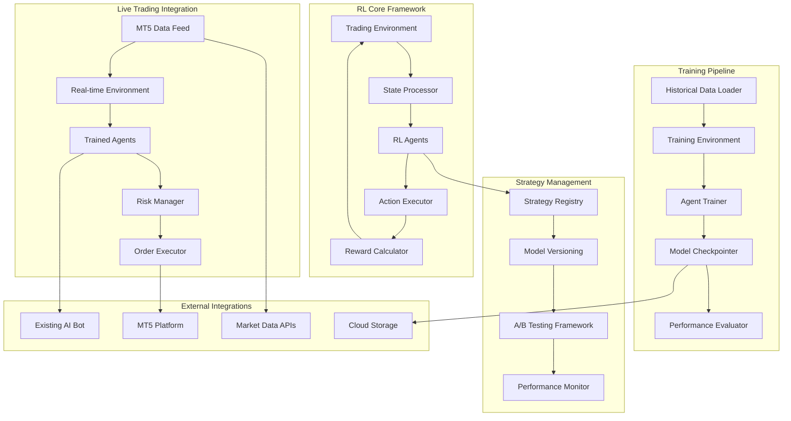

# RL Trading System Design Document

## Overview

The RL Trading System is an advanced machine learning framework that enhances the existing AI forex trading bot with reinforcement learning capabilities. The system implements Deep Q-Networks (DQN) and Proximal Policy Optimization (PPO) agents that learn optimal trading strategies through continuous interaction with market environments. 

The architecture is designed to integrate seamlessly with the existing MT5 infrastructure while providing a scalable, production-ready framework for training, deploying, and managing multiple RL trading agents across different currency pairs and market conditions.

## Architecture

The RL Trading System follows a modular architecture with clear separation between environment simulation, agent training, and live trading execution:



### Core Components

1. **Trading Environment**: Simulates market conditions with state/action/reward spaces
2. **RL Agents**: DQN and PPO implementations with neural network policies
3. **Training Pipeline**: Handles model training, validation, and optimization
4. **Strategy Manager**: Manages multiple agents and deployment strategies
5. **Integration Layer**: Connects with existing MT5 and AI bot infrastructure
6. **Performance Analytics**: Comprehensive monitoring and analysis tools

## Components and Interfaces

### Trading Environment

**Purpose**: Create a standardized environment for RL agents to interact with market data and learn trading strategies.

**Key Classes**:
- `TradingEnvironment`: Main environment class implementing OpenAI Gym interface
- `StateProcessor`: Converts market data into normalized state vectors
- `ActionSpace`: Defines discrete and continuous action spaces for trading
- `RewardCalculator`: Computes multi-objective rewards based on trading performance

**Interfaces**:
```python
class TradingEnvironment(gym.Env):
    def __init__(self, data_source: DataSource, config: EnvConfig):
        self.observation_space = gym.spaces.Box(low=-np.inf, high=np.inf, shape=(state_dim,))
        self.action_space = gym.spaces.Discrete(n_actions)  # or Box for continuous
        
    def reset(self) -> np.ndarray:
        """Reset environment to initial state"""
        
    def step(self, action: int) -> Tuple[np.ndarray, float, bool, dict]:
        """Execute action and return next state, reward, done, info"""
        
    def render(self, mode: str = 'human') -> None:
        """Visualize current environment state"""

class StateProcessor(ABC):
    @abstractmethod
    def process_market_data(self, market_data: MarketData, 
                          technical_indicators: Dict[str, float],
                          sentiment_data: SentimentResult) -> np.ndarray:
        """Convert raw market data into normalized state vector"""
        
    @abstractmethod
    def get_state_dimension(self) -> int:
        """Return the dimension of the state space"""
```

### RL Agents

**Purpose**: Implement DQN and PPO algorithms for learning optimal trading policies.

**Key Classes**:
- `DQNAgent`: Deep Q-Network implementation with experience replay
- `PPOAgent`: Proximal Policy Optimization implementation
- `NeuralNetwork`: Configurable neural network architectures
- `ExperienceBuffer`: Efficient storage and sampling of training experiences

**Interfaces**:
```python
class RLAgent(ABC):
    @abstractmethod
    def select_action(self, state: np.ndarray, training: bool = False) -> int:
        """Select action based on current state"""
        
    @abstractmethod
    def update(self, experiences: List[Experience]) -> Dict[str, float]:
        """Update agent parameters based on experiences"""
        
    @abstractmethod
    def save_model(self, filepath: str) -> None:
        """Save trained model to disk"""
        
    @abstractmethod
    def load_model(self, filepath: str) -> None:
        """Load trained model from disk"""

class DQNAgent(RLAgent):
    def __init__(self, state_dim: int, action_dim: int, config: DQNConfig):
        self.q_network = NeuralNetwork(state_dim, action_dim, config.hidden_layers)
        self.target_network = NeuralNetwork(state_dim, action_dim, config.hidden_layers)
        self.experience_buffer = ExperienceBuffer(config.buffer_size)
        self.epsilon = config.initial_epsilon
        
class PPOAgent(RLAgent):
    def __init__(self, state_dim: int, action_dim: int, config: PPOConfig):
        self.policy_network = NeuralNetwork(state_dim, action_dim, config.hidden_layers)
        self.value_network = NeuralNetwork(state_dim, 1, config.hidden_layers)
        self.clip_ratio = config.clip_ratio
```

### Training Pipeline

**Purpose**: Handle the complete training lifecycle from data preparation to model evaluation.

**Key Classes**:
- `AgentTrainer`: Orchestrates the training process for RL agents
- `HyperparameterOptimizer`: Automated hyperparameter tuning using Optuna
- `TrainingScheduler`: Manages training schedules and resource allocation
- `ModelValidator`: Validates trained models before deployment

**Interfaces**:
```python
class AgentTrainer:
    def __init__(self, agent: RLAgent, environment: TradingEnvironment, config: TrainingConfig):
        self.agent = agent
        self.environment = environment
        self.config = config
        
    def train(self, num_episodes: int) -> TrainingResults:
        """Train agent for specified number of episodes"""
        
    def evaluate(self, num_episodes: int) -> EvaluationResults:
        """Evaluate agent performance on test data"""
        
    def save_checkpoint(self, episode: int) -> str:
        """Save training checkpoint"""

class HyperparameterOptimizer:
    def __init__(self, objective_function: Callable, search_space: Dict[str, Any]):
        self.study = optuna.create_study(direction='maximize')
        
    def optimize(self, n_trials: int) -> Dict[str, Any]:
        """Find optimal hyperparameters"""
```

### Strategy Manager

**Purpose**: Manage multiple RL strategies, handle deployment, and coordinate strategy allocation.

**Key Classes**:
- `StrategyRegistry`: Central registry for all trained RL strategies
- `StrategyAllocator`: Manages capital allocation across multiple strategies
- `ModelVersioning`: Handles model versioning and rollback capabilities
- `ABTestingFramework`: Implements A/B testing for strategy comparison

**Interfaces**:
```python
class StrategyRegistry:
    def register_strategy(self, strategy: RLStrategy, metadata: StrategyMetadata) -> str:
        """Register new strategy with unique ID"""
        
    def get_strategy(self, strategy_id: str) -> RLStrategy:
        """Retrieve strategy by ID"""
        
    def list_strategies(self, filters: Dict[str, Any] = None) -> List[StrategyMetadata]:
        """List all registered strategies with optional filtering"""
        
    def update_performance(self, strategy_id: str, performance: PerformanceMetrics) -> None:
        """Update strategy performance metrics"""

class StrategyAllocator:
    def __init__(self, allocation_method: str = 'performance_weighted'):
        self.allocation_method = allocation_method
        
    def calculate_allocations(self, strategies: List[RLStrategy], 
                            performance_history: Dict[str, List[float]]) -> Dict[str, float]:
        """Calculate optimal capital allocation across strategies"""
```

### Integration Layer

**Purpose**: Seamlessly integrate RL system with existing MT5 infrastructure and AI trading bot.

**Key Classes**:
- `MT5Connector`: Enhanced MT5 integration for RL-specific requirements
- `RLSignalGenerator`: Converts RL agent actions into trading signals
- `HybridDecisionEngine`: Combines RL signals with existing AI bot signals
- `RealTimeEnvironment`: Live trading environment using real market data

**Interfaces**:
```python
class RLSignalGenerator:
    def __init__(self, agent: RLAgent, risk_manager: RiskManager):
        self.agent = agent
        self.risk_manager = risk_manager
        
    def generate_signal(self, market_state: np.ndarray) -> TradingSignal:
        """Convert RL agent action to trading signal"""
        
class HybridDecisionEngine:
    def __init__(self, rl_agents: List[RLAgent], ai_bot: AITradingBot, config: HybridConfig):
        self.rl_agents = rl_agents
        self.ai_bot = ai_bot
        self.config = config
        
    def make_decision(self, market_data: MarketData) -> TradingDecision:
        """Combine RL and AI bot signals for final trading decision"""
```

## Data Models

### Core RL Data Structures

```python
@dataclass
class Experience:
    state: np.ndarray
    action: int
    reward: float
    next_state: np.ndarray
    done: bool
    timestamp: datetime

@dataclass
class TrainingConfig:
    learning_rate: float
    batch_size: int
    num_episodes: int
    max_steps_per_episode: int
    epsilon_decay: float
    target_update_frequency: int
    checkpoint_frequency: int

@dataclass
class RLStrategy:
    strategy_id: str
    agent_type: str  # 'DQN', 'PPO'
    model_path: str
    config: Dict[str, Any]
    performance_metrics: PerformanceMetrics
    created_at: datetime
    last_updated: datetime

@dataclass
class EnvironmentConfig:
    state_features: List[str]
    action_space_type: str  # 'discrete', 'continuous'
    reward_function: str
    lookback_window: int
    normalization_method: str
    transaction_cost: float

@dataclass
class PerformanceMetrics:
    total_return: float
    sharpe_ratio: float
    max_drawdown: float
    win_rate: float
    profit_factor: float
    calmar_ratio: float
    sortino_ratio: float
    num_trades: int
    avg_trade_duration: float

@dataclass
class TrainingResults:
    episode_rewards: List[float]
    episode_lengths: List[int]
    loss_history: List[float]
    epsilon_history: List[float]
    training_time: float
    final_performance: PerformanceMetrics
```

### State Space Design

The state space combines multiple data sources into a normalized vector:

```python
class StateFeatures:
    # Price-based features (normalized)
    price_features = [
        'close_price_norm',      # Normalized close price
        'high_low_ratio',        # (High - Low) / Close
        'open_close_ratio',      # (Close - Open) / Open
        'volume_norm'            # Normalized volume
    ]
    
    # Technical indicators (normalized to [-1, 1])
    technical_features = [
        'rsi_norm',              # RSI normalized to [-1, 1]
        'macd_signal',           # MACD signal line
        'bb_position',           # Position within Bollinger Bands
        'stoch_k', 'stoch_d'     # Stochastic oscillator
    ]
    
    # Market microstructure
    microstructure_features = [
        'bid_ask_spread',        # Normalized spread
        'order_flow_imbalance',  # Buy/sell pressure
        'volatility_regime'      # Current volatility state
    ]
    
    # Sentiment and external factors
    external_features = [
        'sentiment_score',       # From existing AI bot
        'news_impact',          # News event impact score
        'market_session',       # Trading session indicator
        'day_of_week'           # Temporal feature
    ]
    
    # Portfolio and risk features
    portfolio_features = [
        'current_position',      # Current position size
        'unrealized_pnl',       # Current P&L
        'portfolio_heat',       # Risk exposure level
        'correlation_risk'      # Cross-pair correlation
    ]

def create_state_vector(market_data: MarketData, 
                       technical_indicators: Dict[str, float],
                       sentiment_data: SentimentResult,
                       portfolio_state: PortfolioState) -> np.ndarray:
    """Combine all features into normalized state vector"""
    features = []
    
    # Add price features
    features.extend(normalize_price_features(market_data))
    
    # Add technical features
    features.extend(normalize_technical_features(technical_indicators))
    
    # Add external features
    features.extend([
        sentiment_data.sentiment_score,
        sentiment_data.confidence,
        get_market_session_encoding(market_data.timestamp),
        get_temporal_encoding(market_data.timestamp)
    ])
    
    # Add portfolio features
    features.extend(normalize_portfolio_features(portfolio_state))
    
    return np.array(features, dtype=np.float32)
```

### Action Space Design

```python
class ActionSpace:
    # Discrete action space
    DISCRETE_ACTIONS = {
        0: 'HOLD',
        1: 'BUY_SMALL',    # 0.5% position
        2: 'BUY_MEDIUM',   # 1.0% position
        3: 'BUY_LARGE',    # 2.0% position
        4: 'SELL_SMALL',   # -0.5% position
        5: 'SELL_MEDIUM',  # -1.0% position
        6: 'SELL_LARGE',   # -2.0% position
        7: 'CLOSE_POSITION' # Close current position
    }
    
    # Continuous action space (alternative)
    # Action vector: [position_change, stop_loss_distance, take_profit_distance]
    # position_change: [-1, 1] where -1 = max short, +1 = max long
    # stop_loss_distance: [0, 1] normalized distance
    # take_profit_distance: [0, 1] normalized distance

def execute_action(action: int, current_position: float, 
                  market_data: MarketData, risk_params: RiskParams) -> Order:
    """Convert RL action to actual trading order"""
    action_type = ActionSpace.DISCRETE_ACTIONS[action]
    
    if action_type == 'HOLD':
        return None
    elif action_type == 'CLOSE_POSITION':
        return create_close_order(current_position)
    else:
        position_size = get_position_size(action_type, risk_params)
        return create_market_order(position_size, market_data)
```

### Reward Function Design

```python
class RewardCalculator:
    def __init__(self, config: RewardConfig):
        self.config = config
        
    def calculate_reward(self, prev_state: PortfolioState, 
                        current_state: PortfolioState,
                        action: int, market_data: MarketData) -> float:
        """Multi-objective reward function"""
        
        # Base reward: realized P&L
        pnl_reward = (current_state.realized_pnl - prev_state.realized_pnl) / self.config.capital_base
        
        # Risk-adjusted reward component
        sharpe_component = self.calculate_sharpe_reward(current_state)
        
        # Drawdown penalty
        drawdown_penalty = self.calculate_drawdown_penalty(current_state)
        
        # Transaction cost penalty
        transaction_penalty = self.calculate_transaction_cost(action, market_data)
        
        # Holding time reward (encourage position management)
        holding_reward = self.calculate_holding_reward(current_state)
        
        # Combine components with weights
        total_reward = (
            self.config.pnl_weight * pnl_reward +
            self.config.sharpe_weight * sharpe_component +
            self.config.drawdown_weight * drawdown_penalty +
            self.config.transaction_weight * transaction_penalty +
            self.config.holding_weight * holding_reward
        )
        
        return np.clip(total_reward, -self.config.max_reward, self.config.max_reward)
```

## Error Handling

### RL-Specific Error Handling

1. **Training Instabilities**
   - Gradient explosion: Implement gradient clipping and learning rate scheduling
   - Policy collapse: Use entropy regularization and early stopping
   - Overfitting: Implement validation-based early stopping and regularization

2. **Environment Errors**
   - Invalid states: State validation and normalization bounds checking
   - Action execution failures: Fallback to safe actions (HOLD)
   - Data inconsistencies: Data validation and interpolation strategies

3. **Model Deployment Errors**
   - Model loading failures: Automatic fallback to previous model version
   - Inference errors: Exception handling with default conservative actions
   - Performance degradation: Automatic model rollback based on performance thresholds

4. **Integration Errors**
   - MT5 connection issues: Graceful degradation to paper trading mode
   - Signal conflicts: Priority-based resolution between RL and AI bot signals
   - Resource constraints: Dynamic model switching based on available resources

## Testing Strategy

### RL-Specific Testing Approaches

1. **Environment Testing**
   - State space validation with edge cases
   - Action space boundary testing
   - Reward function unit tests with known scenarios
   - Environment reset and episode termination testing

2. **Agent Testing**
   - Policy network forward pass validation
   - Training loop convergence testing
   - Experience buffer functionality testing
   - Model save/load consistency testing

3. **Integration Testing**
   - End-to-end training pipeline testing
   - Live trading simulation with paper money
   - Performance metric calculation validation
   - Strategy switching and allocation testing

4. **Performance Testing**
   - Training speed benchmarks
   - Memory usage profiling during training
   - Inference latency testing for live trading
   - Scalability testing with multiple agents

5. **Backtesting Framework**
   - Historical data replay with RL agents
   - Walk-forward analysis implementation
   - Out-of-sample testing protocols
   - Benchmark comparison against buy-and-hold and existing AI bot

The RL Trading System design provides a comprehensive framework for implementing, training, and deploying reinforcement learning agents in forex trading environments while maintaining seamless integration with existing infrastructure and robust production-ready capabilities.