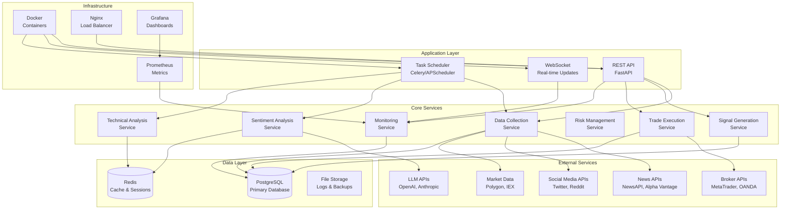
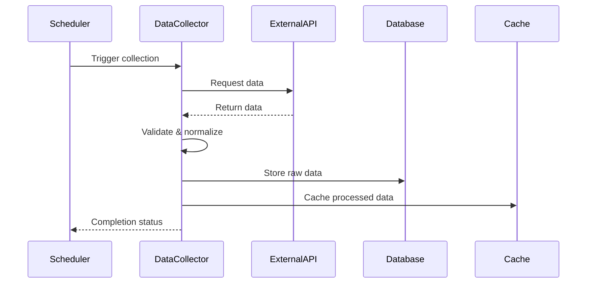
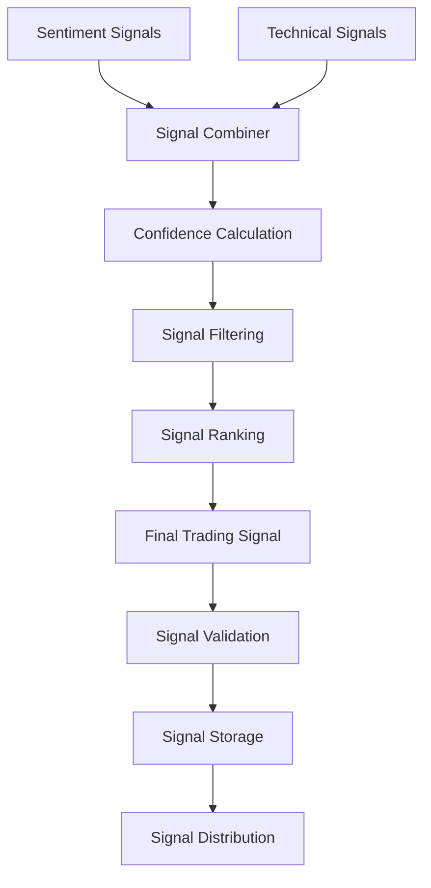
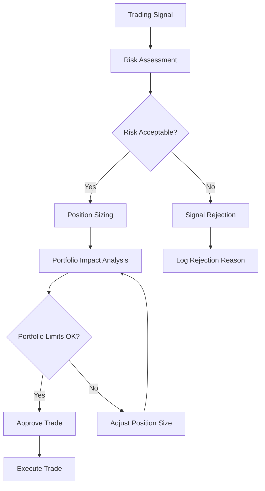
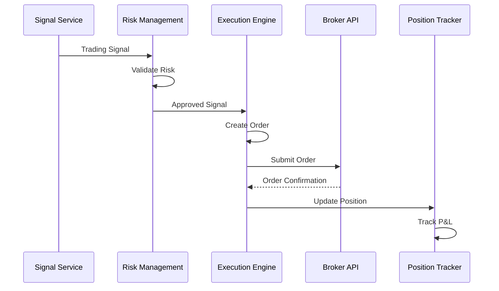
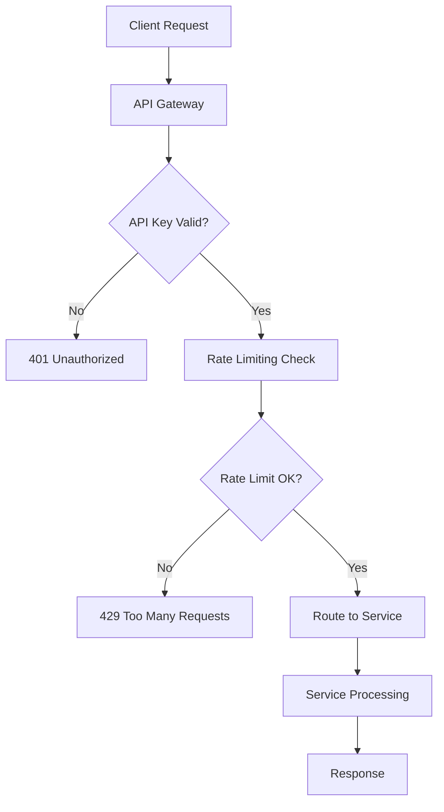
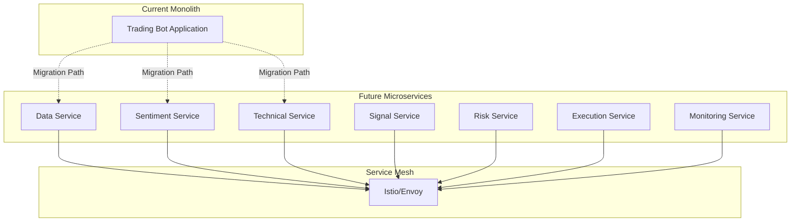

# System Architecture Documentation

## Overview

The AI Forex Trading Bot is built using a modular, microservices-inspired architecture that separates concerns and enables scalability. This document provides a comprehensive overview of the system architecture, component interactions, and design decisions.

## High-Level Architecture



## Core Components

### 1. Data Collection Service

**Purpose**: Collect and normalize data from multiple external sources.

**Components**:
- `MarketDataCollector`: Real-time market data
- `NewsDataCollector`: Financial news articles
- `SocialMediaCollector`: Social media sentiment
- `DataNormalizer`: Data standardization
- `DataValidator`: Input validation

**Key Features**:
- Multi-source data aggregation
- Real-time data streaming
- Data quality validation
- Error handling and retry logic
- Rate limiting compliance

**Data Flow**:


### 2. Sentiment Analysis Service

**Purpose**: Process textual data through LLM APIs to extract market sentiment.

**Components**:
- `LLMClient`: API client management
- `PromptEngine`: Prompt optimization
- `ResponseParser`: Response validation
- `SentimentAggregator`: Multi-source aggregation
- `ConfidenceCalculator`: Reliability scoring

**Key Features**:
- Multi-provider LLM support
- Prompt engineering optimization
- Response validation and hallucination detection
- Sentiment aggregation algorithms
- Confidence scoring mechanisms

**Processing Pipeline**:

```mermaid
flowchart LR
    A[Raw Text Data] --> B[Text Preprocessing]
    B --> C[Prompt Generation]
    C --> D[LLM API Call]
    D --> E[Response Parsing]
    E --> F[Validation]
    F --> G[Sentiment Score]
    G --> H[Confidence Calculation]
    H --> I[Aggregation]
    I --> J[Final Sentiment Result]
```


### 3. Technical Analysis Service

**Purpose**: Calculate technical indicators and identify trading patterns.

**Components**:
- `IndicatorCalculator`: Technical indicators
- `PatternRecognizer`: Chart patterns
- `TrendAnalyzer`: Market trends
- `SignalValidator`: Signal validation
- `TimeframeManager`: Multi-timeframe analysis

**Key Features**:
- 50+ technical indicators
- Pattern recognition algorithms
- Multi-timeframe analysis
- Signal strength calculation
- Trend confirmation logic

**Indicator Categories**:
- **Trend Indicators**: SMA, EMA, MACD, ADX
- **Momentum Indicators**: RSI, Stochastic, Williams %R
- **Volatility Indicators**: Bollinger Bands, ATR
- **Volume Indicators**: OBV, Volume Profile
- **Support/Resistance**: Pivot Points, Fibonacci

### 4. Signal Generation Service

**Purpose**: Combine sentiment and technical analysis to generate trading signals.

**Components**:
- `SignalCombiner`: Multi-source signal fusion
- `ConfidenceCalculator`: Signal reliability
- `SignalFilter`: Quality filtering
- `SignalRanker`: Priority ranking
- `SignalTracker`: Performance tracking

**Key Features**:
- Weighted signal combination
- Machine learning-based scoring
- Real-time signal generation
- Historical performance tracking
- Signal expiration management

**Signal Generation Process**:


### 5. Risk Management Service

**Purpose**: Implement comprehensive risk controls and position management.

**Components**:
- `PositionSizer`: Position size calculation
- `RiskCalculator`: Risk assessment
- `DrawdownMonitor`: Drawdown tracking
- `ExposureManager`: Portfolio exposure
- `CircuitBreaker`: Emergency stops

**Key Features**:
- Dynamic position sizing
- Real-time risk monitoring
- Correlation analysis
- Drawdown protection
- Emergency circuit breakers

**Risk Management Framework**:


### 6. Trade Execution Service

**Purpose**: Execute trades through broker APIs with proper order management.

**Components**:
- `BrokerClient`: Broker API integration
- `OrderManager`: Order lifecycle management
- `ExecutionEngine`: Trade execution logic
- `PositionTracker`: Position monitoring
- `SlippageCalculator`: Execution quality

**Key Features**:
- Multi-broker support
- Order type flexibility
- Execution quality monitoring
- Position reconciliation
- Error handling and recovery

**Execution Workflow**:


### 7. Monitoring Service

**Purpose**: Monitor system health, performance, and trading metrics.

**Components**:
- `PerformanceMonitor`: Trading performance
- `SystemMonitor`: System health
- `AlertSystem`: Alert management
- `LoggingSystem`: Structured logging
- `MetricsCollector`: Metrics aggregation

**Key Features**:
- Real-time monitoring
- Automated alerting
- Performance analytics
- System health checks
- Comprehensive logging

## Data Architecture

### Database Schema

```sql
-- Core trading tables
CREATE TABLE trades (
    id SERIAL PRIMARY KEY,
    trade_id VARCHAR(50) UNIQUE NOT NULL,
    symbol VARCHAR(10) NOT NULL,
    direction VARCHAR(5) NOT NULL,
    quantity DECIMAL(15,5) NOT NULL,
    entry_price DECIMAL(10,5) NOT NULL,
    exit_price DECIMAL(10,5),
    stop_loss DECIMAL(10,5),
    take_profit DECIMAL(10,5),
    pnl DECIMAL(15,2),
    status VARCHAR(20) NOT NULL,
    opened_at TIMESTAMP NOT NULL,
    closed_at TIMESTAMP,
    created_at TIMESTAMP DEFAULT NOW()
);

-- Signal tracking
CREATE TABLE signals (
    id SERIAL PRIMARY KEY,
    signal_id VARCHAR(50) UNIQUE NOT NULL,
    symbol VARCHAR(10) NOT NULL,
    direction VARCHAR(5) NOT NULL,
    confidence DECIMAL(3,2) NOT NULL,
    sentiment_score DECIMAL(3,2),
    technical_score DECIMAL(3,2),
    reasoning TEXT,
    status VARCHAR(20) NOT NULL,
    created_at TIMESTAMP DEFAULT NOW()
);

-- Market data
CREATE TABLE market_data (
    id SERIAL PRIMARY KEY,
    symbol VARCHAR(10) NOT NULL,
    timestamp TIMESTAMP NOT NULL,
    open_price DECIMAL(10,5) NOT NULL,
    high_price DECIMAL(10,5) NOT NULL,
    low_price DECIMAL(10,5) NOT NULL,
    close_price DECIMAL(10,5) NOT NULL,
    volume BIGINT,
    bid DECIMAL(10,5),
    ask DECIMAL(10,5),
    spread DECIMAL(6,5),
    created_at TIMESTAMP DEFAULT NOW()
);

-- Performance metrics
CREATE TABLE performance_metrics (
    id SERIAL PRIMARY KEY,
    date DATE NOT NULL,
    total_trades INTEGER DEFAULT 0,
    winning_trades INTEGER DEFAULT 0,
    losing_trades INTEGER DEFAULT 0,
    total_pnl DECIMAL(15,2) DEFAULT 0,
    max_drawdown DECIMAL(5,4) DEFAULT 0,
    sharpe_ratio DECIMAL(6,4),
    created_at TIMESTAMP DEFAULT NOW()
);
```

### Caching Strategy

**Redis Cache Structure**:
```
trading_bot:
├── market_data:{symbol}:{timeframe}     # Market data cache (TTL: 60s)
├── sentiment:{symbol}:{date}            # Sentiment cache (TTL: 1h)
├── technical:{symbol}:{timeframe}       # Technical indicators (TTL: 5m)
├── signals:{symbol}                     # Active signals (TTL: 24h)
├── config:*                            # Configuration cache (TTL: 1h)
└── session:*                           # User sessions (TTL: 24h)
```

## Security Architecture

### Authentication & Authorization



### Security Measures

1. **API Security**:
   - API key authentication
   - Rate limiting per client
   - Input validation and sanitization
   - CORS configuration

2. **Data Security**:
   - Encrypted database connections
   - Sensitive data encryption at rest
   - Secure API key storage
   - Regular security audits

3. **Network Security**:
   - HTTPS/TLS encryption
   - Firewall configuration
   - VPN access for management
   - Network segmentation

## Deployment Architecture

### Container Architecture

```yaml
# docker-compose.yml structure
services:
  # Application services
  forex-bot:
    image: ai-forex-trading-bot:latest
    environment:
      - DATABASE_URL=postgresql://...
      - REDIS_URL=redis://...
    depends_on:
      - postgres
      - redis
    
  # Data services
  postgres:
    image: postgres:15
    volumes:
      - postgres_data:/var/lib/postgresql/data
    
  redis:
    image: redis:7-alpine
    volumes:
      - redis_data:/data
    
  # Monitoring services
  prometheus:
    image: prom/prometheus:latest
    volumes:
      - ./prometheus.yml:/etc/prometheus/prometheus.yml
    
  grafana:
    image: grafana/grafana:latest
    volumes:
      - grafana_data:/var/lib/grafana
```

### Scaling Strategy

**Horizontal Scaling**:
- Stateless application design
- Load balancer distribution
- Database connection pooling
- Cache layer optimization

**Vertical Scaling**:
- Resource monitoring
- Dynamic resource allocation
- Performance optimization
- Memory management

## Performance Considerations

### Optimization Strategies

1. **Database Optimization**:
   - Connection pooling
   - Query optimization
   - Proper indexing
   - Partitioning for large tables

2. **Caching Strategy**:
   - Multi-level caching
   - Cache warming
   - TTL optimization
   - Cache invalidation

3. **API Optimization**:
   - Request batching
   - Response compression
   - Connection reuse
   - Async processing

4. **Memory Management**:
   - Object pooling
   - Garbage collection tuning
   - Memory leak prevention
   - Resource cleanup

### Performance Metrics

- **Response Time**: < 100ms for critical operations
- **Throughput**: 1000+ requests/second
- **Memory Usage**: < 2GB under peak load
- **CPU Usage**: < 50% under normal load
- **Database Connections**: < 50 concurrent connections

## Monitoring & Observability

### Metrics Collection

```python
# Key metrics tracked
METRICS = {
    'trading': [
        'total_trades',
        'win_rate',
        'total_pnl',
        'current_drawdown',
        'active_positions'
    ],
    'system': [
        'cpu_usage',
        'memory_usage',
        'disk_usage',
        'network_io',
        'database_connections'
    ],
    'api': [
        'request_count',
        'response_time',
        'error_rate',
        'rate_limit_hits'
    ]
}
```

### Alerting Rules

```yaml
# Prometheus alerting rules
groups:
  - name: trading_alerts
    rules:
      - alert: HighDrawdown
        expr: current_drawdown > 0.15
        for: 5m
        labels:
          severity: warning
        annotations:
          summary: "High drawdown detected"
      
      - alert: SystemDown
        expr: up == 0
        for: 1m
        labels:
          severity: critical
        annotations:
          summary: "Trading system is down"
```

## Disaster Recovery

### Backup Strategy

1. **Database Backups**:
   - Daily full backups
   - Hourly incremental backups
   - Point-in-time recovery
   - Cross-region replication

2. **Configuration Backups**:
   - Version-controlled configuration
   - Automated backup scripts
   - Configuration validation
   - Rollback procedures

3. **Log Retention**:
   - 90-day log retention
   - Compressed log storage
   - Log rotation policies
   - Centralized log management

### Recovery Procedures

1. **System Recovery**:
   - Automated health checks
   - Graceful degradation
   - Circuit breaker patterns
   - Failover mechanisms

2. **Data Recovery**:
   - Database restoration
   - Data consistency checks
   - Transaction replay
   - State reconciliation

## Future Architecture Considerations

### Microservices Migration



### Cloud-Native Features

1. **Kubernetes Deployment**:
   - Container orchestration
   - Auto-scaling capabilities
   - Service discovery
   - Health checks

2. **Event-Driven Architecture**:
   - Message queues (RabbitMQ/Kafka)
   - Event sourcing
   - CQRS pattern
   - Saga pattern for transactions

3. **Observability Stack**:
   - Distributed tracing (Jaeger)
   - Centralized logging (ELK Stack)
   - Metrics collection (Prometheus)
   - Visualization (Grafana)

## Conclusion

The AI Forex Trading Bot architecture is designed for scalability, reliability, and maintainability. The modular design allows for independent scaling and deployment of components, while the comprehensive monitoring and alerting ensure system reliability. The architecture supports both current requirements and future growth, with clear migration paths to cloud-native technologies.